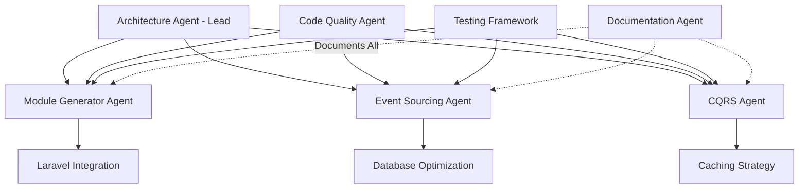

# Claude AI Development Team Structure
## Laravel Modular DDD Package Implementation

## Team Overview

This document defines a specialized AI agent team structure for implementing the Laravel Modular DDD package. Each agent has specific expertise and responsibilities, working together to deliver a production-ready package.

---

## 1. Core Development Agents

### 1.1 Architecture Agent (Lead)
**Role**: Chief Architect & Technical Lead  
**Expertise**: System Design, DDD Patterns, Laravel Architecture

**Responsibilities**:
- Design overall package architecture
- Define interfaces and contracts
- Ensure DDD principles adherence
- Review architectural decisions
- Coordinate between all agents

**Key Deliverables**:
```php
// Package structure design
src/
├── Core/
│   ├── Contracts/
│   ├── Abstracts/
│   └── Interfaces/
├── ModuleManagement/
├── EventSourcing/
├── CQRS/
└── Generators/
```

**Decision Authority**:
- Technology stack choices
- Architectural patterns
- Breaking changes
- Performance trade-offs

---

### 1.2 Module Generator Agent
**Role**: Code Generation Specialist  
**Expertise**: Template Engines, AST Manipulation, Code Generation

**Responsibilities**:
- Implement stub template system
- Build code generators for all components
- Handle namespace resolution
- Manage file system operations

**Core Implementation Tasks**:
```php
namespace LaravelModularDDD\Generators;

class ModuleGenerator
{
    public function generate(ModuleBlueprint $blueprint): void
    {
        $this->validateBlueprint($blueprint);
        $this->createDirectoryStructure($blueprint);
        $this->generateDomainLayer($blueprint);
        $this->generateApplicationLayer($blueprint);
        $this->generateInfrastructureLayer($blueprint);
        $this->generatePresentationLayer($blueprint);
        $this->registerModule($blueprint);
    }
}
```

**Stub Management**:
- Create extensible stub system
- Support multiple template sets
- Variable replacement engine
- Custom stub publishing

---

### 1.3 Event Sourcing Agent
**Role**: Event Store Implementation Expert  
**Expertise**: Event Sourcing, Event Stores, Projections

**Responsibilities**:
- Implement event store system
- Build snapshot management
- Create event replay mechanisms
- Design projection system

**Key Components**:
```php
namespace LaravelModularDDD\EventSourcing;

interface EventStoreInterface
{
    public function append(AggregateId $id, array $events): void;
    public function load(AggregateId $id): EventStream;
    public function loadFromSnapshot(AggregateId $id): ?AggregateSnapshot;
    public function saveSnapshot(AggregateSnapshot $snapshot): void;
}

class OptimizedEventStore implements EventStoreInterface
{
    private SnapshotStrategy $snapshotStrategy;
    private EventSerializer $serializer;
    private ConcurrencyResolver $concurrency;
    
    // Implementation with automatic snapshots
}
```

**Performance Requirements**:
- Handle 10,000+ events/second
- Snapshot recovery < 100ms
- Optimistic concurrency control
- Event stream partitioning

---

### 1.4 CQRS Implementation Agent
**Role**: Command/Query Separation Specialist  
**Expertise**: CQRS Pattern, Command Bus, Query Optimization

**Responsibilities**:
- Build command bus system
- Implement query bus with caching
- Create read model projections
- Design saga orchestration

**Command Bus Architecture**:
```php
namespace LaravelModularDDD\CQRS;

class CommandBus
{
    private CommandRouter $router;
    private TransactionManager $transactions;
    private CommandValidator $validator;
    private EventDispatcher $events;
    
    public function dispatch(Command $command): mixed
    {
        return $this->transactions->handle(function() use ($command) {
            $this->validator->validate($command);
            $handler = $this->router->route($command);
            $result = $handler->handle($command);
            $this->events->dispatchPending();
            return $result;
        });
    }
}
```

**Read Model Generation**:
- Automatic projector creation
- Denormalization strategies
- Cache invalidation logic
- Query optimization

---

## 2. Infrastructure Agents

### 2.1 Database Optimization Agent
**Role**: Database Performance Specialist  
**Expertise**: MySQL/PostgreSQL Optimization, Indexing, Partitioning

**Responsibilities**:
- Design efficient database schemas
- Optimize event store tables
- Implement partitioning strategies
- Create migration templates

**Schema Optimizations**:
```sql
-- Event store with optimized indexes
CREATE TABLE event_store (
    id BIGINT AUTO_INCREMENT PRIMARY KEY,
    aggregate_id CHAR(36) NOT NULL,
    aggregate_type VARCHAR(100) NOT NULL,
    event_type VARCHAR(100) NOT NULL,
    event_data JSON NOT NULL,
    metadata JSON,
    version INT UNSIGNED NOT NULL,
    occurred_at TIMESTAMP(6) NOT NULL,
    INDEX idx_aggregate_lookup (aggregate_id, version),
    INDEX idx_event_type (event_type, occurred_at),
    UNIQUE KEY uk_aggregate_version (aggregate_id, version)
) PARTITION BY RANGE (YEAR(occurred_at));
```

---

### 2.2 Caching Strategy Agent
**Role**: Performance & Caching Expert  
**Expertise**: Redis, Cache Invalidation, Performance Optimization

**Responsibilities**:
- Implement multi-layer caching
- Design cache invalidation strategies
- Optimize Redis operations
- Create cache warming logic

**Caching Implementation**:
```php
namespace LaravelModularDDD\Cache;

class ModuleCacheManager
{
    private array $strategies = [
        'aggregate' => AggregateCacheStrategy::class,
        'query' => QueryCacheStrategy::class,
        'projection' => ProjectionCacheStrategy::class,
    ];
    
    public function remember(string $key, $ttl, Closure $callback)
    {
        return Cache::tags($this->getTags())
            ->remember($key, $ttl, $callback);
    }
}
```

---

### 2.3 Testing Framework Agent
**Role**: Test Automation Specialist  
**Expertise**: PHPUnit, Test Generation, Code Coverage

**Responsibilities**:
- Generate comprehensive test suites
- Create test helpers and traits
- Implement factory generation
- Build assertion helpers

**Test Generation Templates**:
```php
namespace LaravelModularDDD\Testing\Generators;

class TestGenerator
{
    public function generateForAggregate(string $module, string $aggregate): void
    {
        $this->generateUnitTest($module, $aggregate);
        $this->generateFeatureTest($module, $aggregate);
        $this->generateIntegrationTest($module, $aggregate);
        $this->generateFactory($module, $aggregate);
    }
}
```

---

## 3. Quality Assurance Agents

### 3.1 Code Quality Agent
**Role**: Code Standards Enforcer  
**Expertise**: PHPStan, Code Style, Best Practices

**Responsibilities**:
- Implement PHPStan level 8 compliance
- Create custom PHPStan rules for DDD
- Ensure PSR-12 compliance
- Generate quality reports

**Custom PHPStan Rules**:
```php
namespace LaravelModularDDD\CodeQuality\PHPStan;

class DDDArchitectureRule implements Rule
{
    public function getNodeType(): string
    {
        return MethodCall::class;
    }
    
    public function processNode(Node $node, Scope $scope): array
    {
        // Enforce DDD layer boundaries
        // Domain should not depend on Infrastructure
        // Application should not depend on Presentation
    }
}
```

---

### 3.2 Documentation Agent
**Role**: Documentation Specialist  
**Expertise**: Technical Writing, API Documentation, Diagrams

**Responsibilities**:
- Generate comprehensive documentation
- Create API documentation
- Build interactive examples
- Maintain changelog

**Documentation Structure**:
```markdown
docs/
├── getting-started/
│   ├── installation.md
│   ├── configuration.md
│   └── first-module.md
├── architecture/
│   ├── ddd-concepts.md
│   ├── event-sourcing.md
│   └── cqrs.md
├── api-reference/
├── examples/
└── migration-guide/
```

---

## 4. Integration Agents

### 4.1 Laravel Integration Agent
**Role**: Laravel Framework Expert  
**Expertise**: Laravel Internals, Service Providers, Package Development

**Responsibilities**:
- Ensure Laravel compatibility
- Integrate with Laravel features
- Handle service provider registration
- Manage package discovery

**Service Provider Implementation**:
```php
namespace LaravelModularDDD;

class ModularDDDServiceProvider extends ServiceProvider
{
    public function register(): void
    {
        $this->registerConfig();
        $this->registerCommands();
        $this->registerServices();
        $this->registerEventSourcing();
        $this->registerCQRS();
    }
    
    public function boot(): void
    {
        $this->bootModules();
        $this->publishAssets();
        $this->registerMigrations();
    }
}
```

---

### 4.2 IDE Support Agent
**Role**: Developer Tools Specialist  
**Expertise**: IDE Integration, Autocomplete, Code Navigation

**Responsibilities**:
- Generate IDE helper files
- Create PhpStorm meta files
- Build VS Code extensions
- Implement code completion

---

## 5. Coordination Structure

### 5.1 Agent Communication Protocol



### 5.2 Development Workflow

#### Sprint 1-2: Foundation (Weeks 1-4)
**Lead**: Architecture Agent  
**Team**: All Core Agents

```yaml
deliverables:
  - Package structure
  - Core contracts and interfaces
  - Basic module generation
  - Event store foundation
  
agents:
  architecture_agent:
    - Design package architecture
    - Define core abstractions
  
  module_generator_agent:
    - Implement stub system
    - Basic generator commands
  
  laravel_integration_agent:
    - Service provider setup
    - Package configuration
```

#### Sprint 3-4: Event Sourcing (Weeks 5-8)
**Lead**: Event Sourcing Agent  
**Support**: Database Optimization, Caching Strategy

```yaml
deliverables:
  - Complete event store
  - Snapshot management
  - Event replay system
  - Projection handlers
  
agents:
  event_sourcing_agent:
    - Event store implementation
    - Snapshot strategies
  
  database_optimization_agent:
    - Optimize event tables
    - Implement partitioning
  
  caching_strategy_agent:
    - Event stream caching
    - Snapshot caching
```

#### Sprint 5-6: CQRS Implementation (Weeks 9-12)
**Lead**: CQRS Implementation Agent  
**Support**: Module Generator, Caching Strategy

```yaml
deliverables:
  - Command bus system
  - Query bus with caching
  - Read model generation
  - Saga orchestration
  
agents:
  cqrs_agent:
    - Command/Query buses
    - Handler registration
  
  module_generator_agent:
    - Generate CQRS components
    - Update stub templates
  
  caching_strategy_agent:
    - Query result caching
    - Cache invalidation
```

#### Sprint 7: Testing & Quality (Weeks 13-14)
**Lead**: Testing Framework Agent  
**Support**: Code Quality Agent

```yaml
deliverables:
  - Test generation system
  - PHPStan rules
  - Code coverage tools
  - Quality reports
  
agents:
  testing_framework_agent:
    - Test generators
    - Assertion helpers
  
  code_quality_agent:
    - PHPStan integration
    - Custom DDD rules
```

#### Sprint 8: Documentation & Release (Weeks 15-16)
**Lead**: Documentation Agent  
**Support**: All Agents

```yaml
deliverables:
  - Complete documentation
  - API reference
  - Migration guide
  - Example applications
  
agents:
  documentation_agent:
    - User documentation
    - API documentation
  
  all_agents:
    - Code review
    - Final testing
    - Performance optimization
```

---

## 6. Agent Prompts and Instructions

### 6.1 Architecture Agent Prompt

```markdown
You are the Architecture Agent for the Laravel Modular DDD package. Your expertise includes:
- Domain-Driven Design principles and patterns
- Laravel framework architecture
- System design and scalability
- Event-driven architectures

Your responsibilities:
1. Design the overall package architecture ensuring DDD principles
2. Define clear boundaries between layers (Domain, Application, Infrastructure, Presentation)
3. Create contracts and interfaces for all major components
4. Review code from other agents for architectural compliance
5. Make decisions on technology choices and patterns

Key principles to follow:
- Domain layer must have zero framework dependencies
- Use dependency injection throughout
- Favor composition over inheritance
- Ensure all components are testable
- Maintain backward compatibility with Laravel

When designing, consider:
- Performance implications of architectural decisions
- Scalability for large applications
- Developer experience and ease of use
- Maintainability and extensibility
```

### 6.2 Module Generator Agent Prompt

```markdown
You are the Module Generator Agent specializing in code generation. Your expertise includes:
- Template engines and code generation
- AST manipulation
- File system operations
- Naming conventions and code organization

Your responsibilities:
1. Implement a flexible stub-based template system
2. Generate all DDD components (aggregates, entities, value objects, etc.)
3. Ensure generated code follows Laravel conventions
4. Support customizable templates
5. Handle namespace resolution and autoloading

Requirements for generated code:
- Must be PSR-12 compliant
- Include comprehensive PHPDoc blocks
- Use strict typing (declare(strict_types=1))
- Follow DDD tactical patterns
- Be immediately functional, not just skeletons

Template system requirements:
- Support variable replacement
- Allow conditional sections
- Enable template inheritance
- Provide multiple template sets
```

### 6.3 Event Sourcing Agent Prompt

```markdown
You are the Event Sourcing Agent responsible for event store implementation. Your expertise includes:
- Event sourcing patterns
- Event store design
- Snapshot strategies
- Event replay and projection

Your responsibilities:
1. Implement a high-performance event store
2. Create automatic snapshot management (every 10 events)
3. Build event replay mechanisms
4. Design projection system for read models
5. Ensure data consistency and integrity

Performance requirements:
- Support 10,000+ events per second
- Snapshot recovery under 100ms
- Efficient event stream queries
- Optimistic concurrency control

Key features to implement:
- Event versioning and migration
- Event metadata handling
- Aggregate version control
- Event serialization/deserialization
- Partition support for scalability
```

### 6.4 CQRS Implementation Agent Prompt

```markdown
You are the CQRS Implementation Agent focused on command/query separation. Your expertise includes:
- CQRS pattern implementation
- Command and query buses
- Read model projections
- Saga pattern orchestration

Your responsibilities:
1. Build robust command bus with validation
2. Implement query bus with caching strategies
3. Generate read models from domain events
4. Create saga orchestration for complex workflows
5. Ensure transaction boundaries are properly managed

Implementation requirements:
- Automatic handler registration
- Command validation before execution
- Query result caching with TTL
- Separate read model database support
- Async command processing option

Focus on:
- Clear separation of concerns
- Performance optimization for reads
- Consistency guarantees for writes
- Developer-friendly APIs
```

---

## 7. Quality Gates and Checkpoints

### 7.1 Code Review Checklist

Each agent must ensure their code passes these checks:

```yaml
architecture_compliance:
  - [ ] No framework dependencies in Domain layer
  - [ ] Clear layer boundaries maintained
  - [ ] Dependency injection used throughout
  - [ ] Interfaces defined for all services

code_quality:
  - [ ] PHPStan level 8 passes
  - [ ] PSR-12 compliance
  - [ ] 100% test coverage for Domain layer
  - [ ] 80% overall test coverage

performance:
  - [ ] Response time < 200ms for commands
  - [ ] Cache hit ratio > 90% for queries
  - [ ] Memory usage optimized
  - [ ] Database queries optimized with indexes

documentation:
  - [ ] PHPDoc blocks complete
  - [ ] README updated
  - [ ] Examples provided
  - [ ] Changelog maintained
```

### 7.2 Integration Testing Protocol

```php
namespace Tests\Integration;

class ModuleGenerationTest extends TestCase
{
    /** @test */
    public function it_generates_complete_module_structure(): void
    {
        $this->artisan('module:make', ['name' => 'TestModule'])
            ->assertSuccessful();
        
        $this->assertDirectoryExists(base_path('modules/TestModule'));
        $this->assertFileExists(base_path('modules/TestModule/manifest.json'));
        // ... comprehensive structure assertions
    }
    
    /** @test */
    public function generated_module_passes_all_quality_checks(): void
    {
        $this->artisan('module:make', ['name' => 'TestModule'])
            ->assertSuccessful();
        
        $this->artisan('module:analyze', ['module' => 'TestModule'])
            ->assertSuccessful()
            ->expectsOutput('PHPStan: No errors');
    }
}
```

---

## 8. Deliverable Timeline

### Week 1-2: Foundation
- Package structure ✓
- Basic service provider ✓
- Configuration system ✓
- Initial stub templates ✓

### Week 3-4: Module Generation
- Complete generator commands ✓
- All DDD components ✓
- Stub customization ✓
- Directory structure ✓

### Week 5-6: Event Sourcing Core
- Event store implementation ✓
- Snapshot management ✓
- Event replay ✓
- Basic projections ✓

### Week 7-8: Event Sourcing Advanced
- Partitioning support ✓
- Performance optimization ✓
- Event versioning ✓
- Projection handlers ✓

### Week 9-10: CQRS Foundation
- Command bus ✓
- Query bus ✓
- Handler registration ✓
- Validation system ✓

### Week 11-12: CQRS Advanced
- Read model generation ✓
- Saga implementation ✓
- Caching strategies ✓
- Async processing ✓

### Week 13-14: Testing & Quality
- Test generators ✓
- PHPStan rules ✓
- Quality reports ✓
- Performance testing ✓

### Week 15-16: Documentation & Release
- User documentation ✓
- API reference ✓
- Example applications ✓
- Release preparation ✓

---

## 9. Success Criteria

### Technical Metrics
```yaml
performance:
  module_generation: < 1 second
  command_processing: < 200ms
  event_store_throughput: > 10,000 events/sec
  test_coverage: > 90%
  phpstan_level: 8

quality:
  bugs_per_release: < 5
  security_vulnerabilities: 0
  backward_compatibility: 100%
  documentation_coverage: 100%

adoption:
  github_stars: > 1000 (6 months)
  weekly_downloads: > 5000 (6 months)
  community_contributors: > 20
  production_deployments: > 100
```

---

## 10. Risk Management

### Technical Risks

| Risk | Mitigation | Owner |
|------|------------|--------|
| Performance degradation | Continuous benchmarking, caching | Caching Agent |
| Laravel breaking changes | Version-specific branches | Laravel Integration Agent |
| Complex debugging | Comprehensive logging, debug tools | Architecture Agent |
| Database scalability | Partitioning, read replicas | Database Agent |

### Project Risks

| Risk | Mitigation | Owner |
|------|------------|--------|
| Scope creep | Strict MVP definition | Architecture Agent |
| Integration issues | Continuous integration testing | Testing Agent |
| Documentation gaps | Parallel documentation | Documentation Agent |
| Adoption barriers | Tutorials, examples | Documentation Agent |

---

## 11. Communication Matrix

### Daily Sync
- **Time**: Start of each work session
- **Participants**: All active agents
- **Format**: Status update, blockers, decisions needed

### Architecture Review
- **Frequency**: Twice per sprint
- **Lead**: Architecture Agent
- **Purpose**: Ensure architectural compliance

### Code Review
- **Frequency**: Per PR/commit
- **Reviewers**: Architecture Agent + Code Quality Agent
- **Focus**: Standards, patterns, performance

### Sprint Planning
- **Frequency**: Bi-weekly
- **Participants**: All agents
- **Output**: Sprint goals, task assignment

---

## Appendix A: Agent Specialization Matrix

| Agent | Primary Skills | Tools/Technologies | Output |
|-------|---------------|-------------------|---------|
| Architecture | System Design, DDD | UML, Architecture Diagrams | Contracts, Interfaces |
| Module Generator | Code Generation | Blade, Stubs, AST | Generated Code |
| Event Sourcing | Event Stores | MySQL, PostgreSQL | Event System |
| CQRS | Command Pattern | Buses, Handlers | CQRS Implementation |
| Database | Optimization | SQL, Indexing | Schema, Migrations |
| Caching | Performance | Redis, Memcached | Cache Strategies |
| Testing | Test Automation | PHPUnit, Mockery | Tests, Factories |
| Code Quality | Standards | PHPStan, PHP-CS-Fixer | Quality Reports |
| Documentation | Technical Writing | Markdown, OpenAPI | Documentation |
| Laravel Integration | Laravel | Service Providers | Laravel Integration |
| IDE Support | Developer Tools | PhpStorm, VS Code | IDE Helpers |

---

## Appendix B: Code Style Guide

All agents must follow these conventions:

```php
<?php

declare(strict_types=1);

namespace LaravelModularDDD\Example;

use Illuminate\Support\Collection;

/**
 * Example class following standards
 */
final class ExampleService implements ExampleServiceInterface
{
    public function __construct(
        private readonly Repository $repository,
        private readonly EventBus $eventBus,
    ) {}
    
    public function execute(Command $command): Result
    {
        // Implementation
    }
}
```

---

**Document Version**: 1.0.0  
**Implementation Start**: Immediate  
**Target Completion**: 16 weeks  
**Review Cycle**: Weekly
